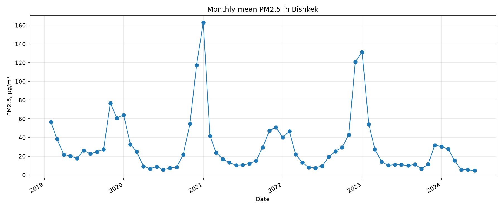

# Bishkek Air Quality

Python project for analyzing PM2.5 measurements from Bishkek.

The project reads CSV data, cleans invalid measurements, calculates descriptive statistics, and produces CSV, JSON, and PNG outputs.

## Features

- CSV loading and validation
- Quality-control filtering
- PM2.5 data cleaning
- Monthly and yearly statistics
- Heating vs. non-heating season comparison
- Data completeness calculation
- CSV, JSON, and PNG output
- Automated tests and Ruff linting

## Results

Data: hourly PM2.5 from one monitor, 6 February 2019 to 30 June 2024 (65 calendar months,
44,509 valid hourly values after cleaning). All numbers below are computed from
`output/all_years_monthly.csv` with `scripts/summarize_results.py`.



- **Season.** Mean PM2.5 was 53.9 µg/m³ in the heating-season months (November–March) and
  14.5 µg/m³ in the other months, a ratio of about 3.7. This is a grouping by calendar months,
  not evidence of a cause.
- **Extremes.** Highest monthly means: January 2021 (162.8 µg/m³), January 2023 (131.3) and
  December 2022 (120.8). Lowest: June 2024 (4.6), July 2020 (5.5) and May 2024 (5.5).
- **Winter-to-winter differences are large.** Means for the five complete November–March
  periods: 51.9 (2019/20), 79.0 (2020/21), 41.1 (2021/22), 75.9 (2022/23) and 23.7 (2023/24)
  µg/m³. The values go up and down, and this project does not explain the differences.
- **Same months across years (March–June).** 24.5 (2019), 12.9 (2020), 16.5 (2021),
  13.5 (2022), 15.8 (2023) and 7.7 (2024) µg/m³. March–June 2024 is the lowest of the six years
  in this data. Coverage is lower in 2022 (June 2022 has only 60% of the expected hourly values),
  so 2022 should be read with caution.
- **Negative values.** See [Negative values](#negative-values): the cleaning rule changes the
  overall mean by about 0.8 µg/m³ and does not change the seasonal pattern.

These results describe one monitoring location, not the whole city. See
[Limitations](#limitations).

## Data source

Hourly PM2.5 measurements from the U.S. Embassy monitor in Bishkek (AirNow), as published in the open dataset by Sarath Guttikunda (2024) on Zenodo: <https://doi.org/10.5281/zenodo.12720883> (license CC BY 4.0).
Dataset title: *A Multi-Pollutant Emissions Inventory for Air Pollution Modeling and Supporting Information for Bishkek* (Version v1).

Related paper: Guttikunda et al., *Air* 2024, 2(4), 362–379, <https://doi.org/10.3390/air2040021>
Paper title: *Mapping PM2.5 Sources and Emission Management Options for Bishkek, Kyrgyzstan*.

## Data

The project uses PM2.5 measurements from the U.S. Department of State air-quality monitoring data available through AirNow. AirNow provides access to air-quality data from U.S. embassies and consulates. The data is preliminary and is not the same as fully validated regulatory data in the EPA Air Quality System (AQS). See `docs/data-notes.md` for the dataset-specific notes.

The current dataset contains:

| Year | Coverage          |
| ---- | ----------------- |
| 2019 | February–December |
| 2020 | January–December  |
| 2021 | January–December  |
| 2022 | January–December  |
| 2023 | January–December  |
| 2024 | January–June      |

The 2024 data is incomplete and should not be directly compared with full-year results.

Some YTD files contain a small number of measurements from the beginning of the following year. When `--year` is used, only measurements from the selected calendar year are analyzed.

Raw data files are kept outside the repository.

## Installation

Requires Python 3.10 or newer.

```bash
git clone https://github.com/Lurish3/BishkekAirQuality.git
cd BishkekAirQuality

python -m venv .venv
source .venv/bin/activate
pip install -e ".[dev]"
```

For fish shell:

```fish
source .venv/bin/activate.fish
```

## Usage

The main command is `bishkek-air`.

Example using the 2020 dataset:

```bash
bishkek-air data/raw/Bishkek_PM2.5_2020_YTD.csv \
  --timestamp-col "Date (LT)" \
  --value-col "Raw Conc." \
  --timestamp-format "%Y-%m-%d %I:%M %p" \
  --qc-col "QC Name" \
  --qc-valid Valid \
  --year 2020 \
  --out output/2020
```

The command creates:

```text
output/2020/
├── monthly_means.csv
├── yearly_means.csv
├── seasonal_summary.csv
├── cleaning_report.json
├── monthly_means.png
└── seasonal_summary.png
```

## Command options

| Option               | Description                  | Default   |
| -------------------- | ---------------------------- | --------- |
| `--timestamp-col`    | Timestamp column             | required  |
| `--value-col`        | PM2.5 column                 | required  |
| `--qc-col`           | Quality-control column       | none      |
| `--qc-valid`         | QC value considered valid    | `Valid`   |
| `--timestamp-format` | Timestamp format             | automatic |
| `--sep`              | CSV separator                | `,`       |
| `--out`              | Output directory             | `output`  |
| `--year`             | Select a calendar year       | none      |
| `--invalid`          | Invalid marker values        | `-999`    |
| `--max-value`        | Maximum accepted PM2.5 value | `1000`    |

## Data cleaning

Before analysis, the program removes:

- missing timestamps or PM2.5 values;
- invalid marker values such as `-999`;
- measurements with invalid QC;
- negative PM2.5 values;
- values above the configured maximum;
- duplicate timestamps.

For duplicate timestamps, the first remaining row is kept.

The default maximum value is `1000 µg/m³`. This is a configurable validation rule, not a claim that higher concentrations are physically impossible.

Every cleaning step is recorded in `cleaning_report.json`.

For a 2020 run, the report includes counts such as:

```json
{
  "rows_in": 8652,
  "dropped_missing": 0,
  "dropped_invalid_marker": 11,
  "dropped_invalid_qc": 21,
  "dropped_negative": 526,
  "dropped_above_max": 0,
  "dropped_duplicate_timestamps": 0,
  "rows_out": 8094
}
```

### Negative values

Small negative readings can be measurement noise, so removing only the negative values may shift averages upwards. The script `scripts/check_negatives.py` compares the mean under three rules (negatives removed, kept as they are, replaced by zero):

```bash
python scripts/check_negatives.py data/raw/Bishkek_PM2.5_20*_YTD.csv \
  --timestamp-col "Date (LT)" --value-col "Raw Conc." \
  --timestamp-format "%Y-%m-%d %I:%M %p" \
  --qc-col "QC Name" --qc-valid Valid
```

About 2.4% of valid hourly values (1,102 of 45,616) are negative. They are small: the lowest
value is −5 µg/m³ and the median is −2 µg/m³, which is consistent with measurement noise
around zero (I have not checked this against the instrument documentation).

The share of negative values differs a lot between years: none in 2019, 0.06% in 2021, and about
6% in 2020 and 2024. A possible explanation is that low values were reported differently in
different years, but I have not verified this.

The current cleaning rule removes negative values. Removing only the negative side can push
averages up: the overall mean is 31.1 µg/m³ with negatives removed and 30.3 µg/m³ with negatives
kept (about 2.6% difference), and the difference is largest in 2020 (30.4 vs. 28.4). The ratio
of the heating-season mean to the non-heating-season mean is about 3.7 with negatives removed and
about 3.8 with negatives kept, so the main seasonal pattern does not depend on this choice.
Because the effect differs between years, small differences between yearly means should not be
over-interpreted. A planned improvement is a `--negatives` option (drop / keep / zero).

## Analysis

The project calculates:

- monthly mean PM2.5 and observation count;
- yearly mean, standard deviation, quartiles, minimum, maximum, and observation count;
- heating and non-heating season statistics;
- expected, observed, and missing hourly observations;
- percentage of temporal coverage.

November–March is currently used as the heating season. This is an analytical grouping, not a claim that heating is the cause of higher PM2.5 concentrations.

## Project-wide analysis

Monthly results from the available years can be combined with:

```bash
python scripts/combine_monthly.py
```

This creates:

```text
output/all_years_monthly.csv
```

The combined dataset covers 65 calendar months:

- February–December 2019
- 2020–2023
- January–June 2024

Create the overall monthly chart:

```bash
python scripts/make_all_years_plot.py
```

Output:

```text
output/all_years_monthly.png
```

Generate the yearly summary:

```bash
python scripts/make_yearly_summary.py
```

Output:

```text
output/yearly_summary.csv
```

## Reproducibility

Each CLI run records information about the input and environment in `cleaning_report.json`, including:

- input file;
- SHA-256 hash of the input file;
- analysis parameters;
- cleaning counts;
- data completeness;
- Python version;
- pandas version;
- matplotlib version;
- project version.

This makes it possible to identify which input data and settings produced a result.

## Tests

Run the test suite with:

```bash
pytest -q
```

Run Ruff:

```bash
ruff check .
```

CI runs both linting and tests on GitHub Actions (see the badge at the top).

## Project structure

```text
BishkekAirQuality/
├── data/raw/          # Raw datasets (not committed)
├── docs/              # Data documentation
├── images/            # Charts used in this README
├── scripts/           # Additional analysis scripts
├── output/            # Generated results (not committed)
├── src/bishkek_air/   # Main Python package
├── tests/             # Automated tests
├── README.md
├── LICENSE
├── pyproject.toml
└── .gitignore
```

Main modules:

- `load.py` — CSV loading
- `clean.py` — data cleaning
- `analyze.py` — descriptive statistics
- `plots.py` — charts
- `cli.py` — command-line interface

## Limitations

- The dataset represents a monitoring location, not the whole city.
- Missing observations can affect calculated statistics.
- Different monitoring instruments or locations may not be directly comparable.
- The analysis does not include weather, traffic, or other possible PM2.5 sources.
- Seasonal differences are descriptive and do not establish causation.
- 2024 contains only January–June data.

## How this project was made

The initial project structure and part of the first code were written with the help of an AI assistant (Claude). I reviewed and extended it: I added the --year option, data completeness for partial years, the reproducibility report (SHA-256 of the input file and library versions), and extra analysis scripts.. I chose the data source, inspected the data files myself, and made the analysis decisions described in `docs/data-notes.md`.

## License

The project code is licensed under the MIT License. See `LICENSE`.

The original PM2.5 data is not automatically covered by this license. It is published under CC BY 4.0 on Zenodo (see [Data source](#data-source)); its source terms and redistribution conditions should be checked before redistributing the data.
